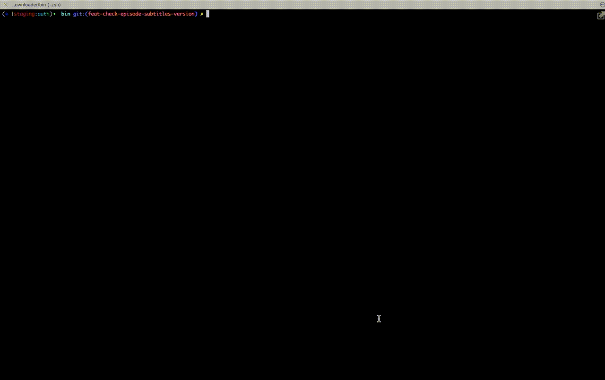
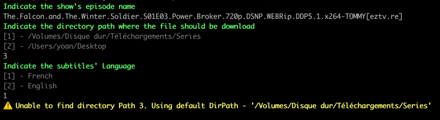
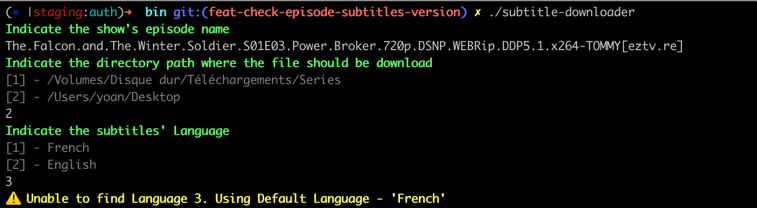
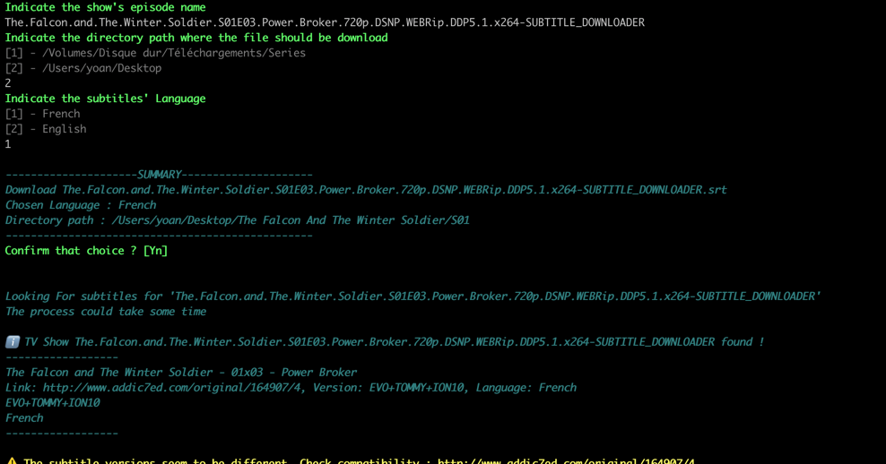
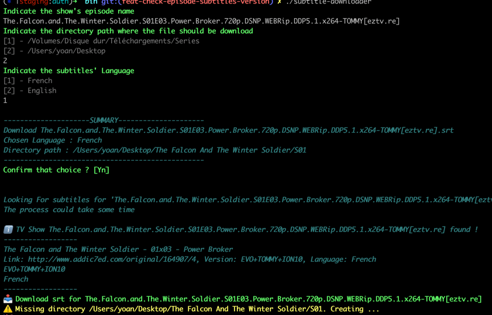
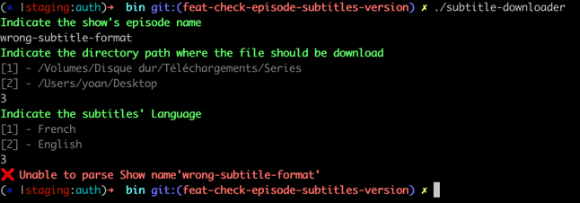
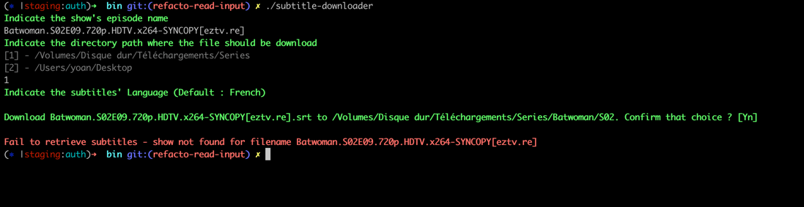
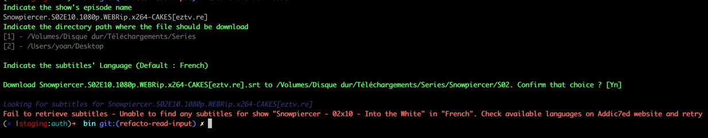

# subtitle-downloader
Download subtittle from Addic7ed thanks to https://github.com/matcornic/addic7ed

## Build
To build sources to an executable, go to `src` directory, then run 

```
go build -o ../bin/subtitle-downloader .
```

## Usage
Go to `bin` directory, then run

```
./subtitle-downloader
```

### Usage Example


### Warning cases

#### Unexpected Directory Input


The input received for the Directory Path does not exist on the list.
In this case, the default directory path will be set

#### Unexpected Language Input


The input received for the Language does not exist on the list.
In this case, the default language path will be set

#### Mismatch subtitle versions


Each subtitle is linked to a version. This version is contained on the Episode name.
When the version contained in the Episode name seems to be different from the found one, 
this message is displayed to let you check the versions' compatibility

#### Missing Targeted Directory


If the directory does not exist, it will be created automatically before downloading subtitles.

### Failure cases
#### Episode name is invalid


We are waiting a specific format for the Episode name. In fact the Episode name should look like this
```
<TVShowName>.S<SEASON>E<EPISODE>-<VERSION>
```

<b>Example</b>: `The.Falcon.and.The.Winter.Soldier.S01E03.Power.Broker-TOMMY`

#### Episode Not found


The Episode was not found on the addic7ed servers.

#### Subtitle Not Found For Language


The Episode has no subtitles for the chosen language
