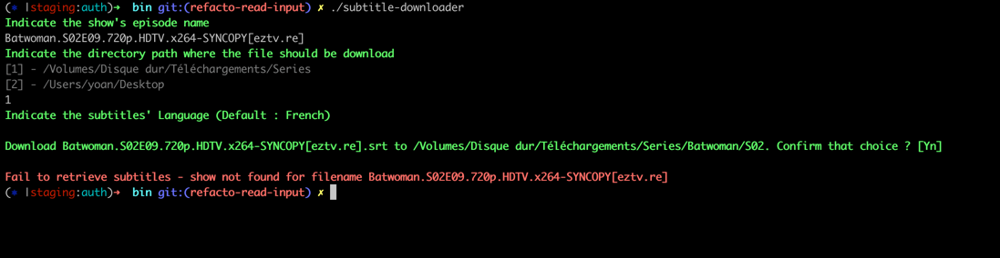
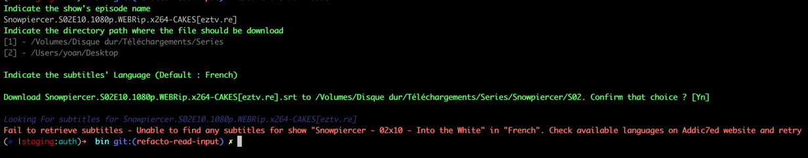

# subtitle-downloader
Download subtittle from Addic7ed

## Build
To build sources to an executable, go to `src` directory, then run 

```
go build -o ../bin/subtitle-downloader .
```

## Usage
Go to `bin` directory, then run

```
./subtitle-downloader
```

### Usage Example


### Failure cases
#### Episode Not found


#### Subtitle Not Found For Language
